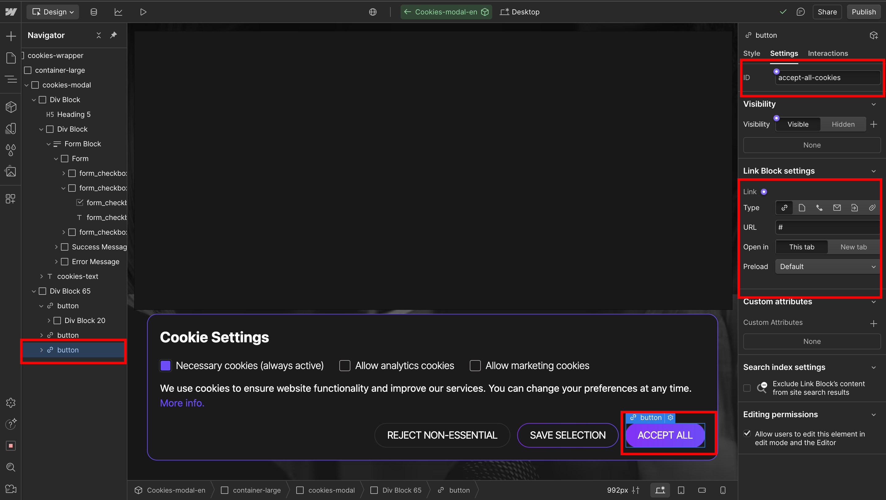
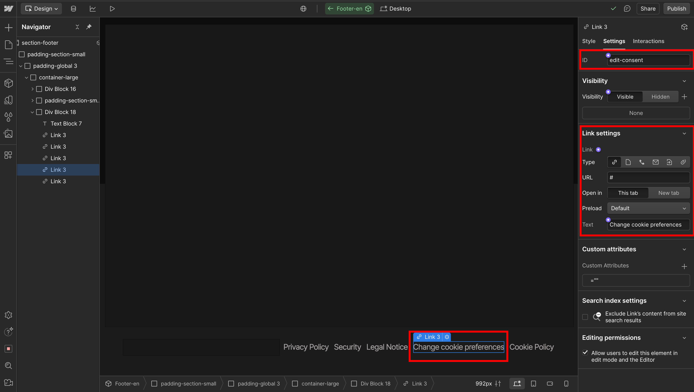

# 🍪Webflow-Cookie-Consent🍪
A simple script to manage third-party script loading based on cookie consent — no coding required inside Webflow!  


---

## ✅ Features

- Auto-loads scripts based on user consent.
- Full integration in Webflow Designer using checkboxes and custom attributes.
- Consent saved via `localStorage`.
- One single modal (`#cookie-banner`) — no page reloads.
- Allows toggling cookies by category (e.g. Analytics, Marketing).
- Loads scripts conditionally based on user consent.
- Reopens settings from a button in footer (e.g. “Edit Consent”).
- Fully Webflow-native: uses custom attributes for control.

---

## 🛠 Installation & Setup

## 1. 🧠 Add the script

Paste the following JS snippet into your 
**Webflow Project > Page Settings > Head Code**/Body Code(Depends on where you need this script)
or Custom Code for the full 
**Project Dashboard > Site Settings > Custom code > Head code/Footer code:

```html
<script>
document.addEventListener("DOMContentLoaded", function () {
  const banner = document.getElementById("cookie-banner");
  const acceptAllBtn = document.getElementById("accept-all-cookies");
  const rejectAllBtn = document.getElementById("reject-all-cookies");
  const saveBtn = document.getElementById("save-selection-cookies");
  const editConsentBtn = document.getElementById("edit-consent");

  function getAllConsentCheckboxes() {
    return document.querySelectorAll('[data-cookie-name][data-cookie-script]');
  }

  function getConsentFromCheckboxes() {
    const checkboxes = getAllConsentCheckboxes();
    const consent = { necessary: true };
    checkboxes.forEach(cb => {
      const name = cb.getAttribute("data-cookie-name");
      consent[name] = cb.checked;
    });
    return consent;
  }

  function applyConsent(consent) {
    const checkboxes = getAllConsentCheckboxes();
    checkboxes.forEach(cb => {
      const name = cb.getAttribute("data-cookie-name");
      const script = cb.getAttribute("data-cookie-script");
      if (consent[name] && script) {
        if (!document.querySelector(`script[data-loaded="${name}"]`)) {
          if (script.trim().startsWith("http")) {
            const s = document.createElement("script");
            s.src = script;
            s.async = true;
            s.setAttribute("data-loaded", name);
            document.head.appendChild(s);
          } else {
            const inline = document.createElement("script");
            inline.innerText = script;
            inline.setAttribute("data-loaded", name);
            document.head.appendChild(inline);
          }
        }
      }
    });
  }

  function saveConsent(consent) {
    localStorage.setItem("cookieConsent", JSON.stringify(consent));
  }

  function loadConsent() {
    const saved = localStorage.getItem("cookieConsent");
    return saved ? JSON.parse(saved) : null;
  }

  function updateCheckboxes(consent) {
    if (!consent) return;
    const checkboxes = getAllConsentCheckboxes();
    checkboxes.forEach(cb => {
      const name = cb.getAttribute("data-cookie-name");
      if (consent[name]) {
        cb.checked = true;
        cb.closest("label")?.click(); // Webflow custom checkbox trigger
      }
    });
  }

  function acceptAll() {
    const checkboxes = getAllConsentCheckboxes();
    const consent = { necessary: true };
    checkboxes.forEach(cb => {
      const name = cb.getAttribute("data-cookie-name");
      consent[name] = true;
    });
    saveConsent(consent);
    applyConsent(consent);
    banner.style.display = "none";
  }

  function rejectAll() {
    const checkboxes = getAllConsentCheckboxes();
    const consent = { necessary: true };
    checkboxes.forEach(cb => {
      const name = cb.getAttribute("data-cookie-name");
      consent[name] = false;
    });
    saveConsent(consent);
    banner.style.display = "none";
  }

  function saveCustomConsent() {
    const consent = getConsentFromCheckboxes();
    saveConsent(consent);
    applyConsent(consent);
    banner.style.display = "none";
  }

  if (acceptAllBtn) acceptAllBtn.addEventListener("click", acceptAll);
  if (rejectAllBtn) rejectAllBtn.addEventListener("click", rejectAll);
  if (saveBtn) saveBtn.addEventListener("click", saveCustomConsent);

  if (editConsentBtn) {
    editConsentBtn.addEventListener("click", function () {
      const saved = loadConsent();
      updateCheckboxes(saved);
      banner.style.display = "block";
    });
  }

  // Initial check
  const savedConsent = loadConsent();
  if (!savedConsent) {
    banner.style.display = "block";
  } else {
    updateCheckboxes(savedConsent);
    applyConsent(savedConsent);
  }
});
</script>
```

---

## 2. 💡 Build your banner in Webflow

Your cookie modal should have the following structure:

- A wrapper element with ID: `cookie-banner` > set in styles display:none
Add this buttons(structure doesnt metter, so technically you can put it anywhere but usually inside the banner, ids metter
- Accept all button with ID: `accept-all-cookies`
- Reject all button with ID: `reject-all-cookies`
- Save selection button with ID: `save-selection-cookies`
Put "Edit cookies" button/link/text/div somewhere you prefer
- Optional "Edit settings" button in the footer with ID: `edit-consent`





---

## 3. ✅ Add checkboxes with attributes

Each consent option should be a checkbox inside a label with the following custom attributes:
change all " to ' in script line 


| Attribute Name         | Value (example)                             |
|------------------------|---------------------------------------------|
| `data-cookie-name`     | `analytics`, `marketing`, etc.              |
| `data-cookie-script`   | Either a URL (e.g., `https://...`) or code  |

#### Example:
```html
<label class="w-checkbox">
  <input type="checkbox"
         id="analytics-cookies"
         data-cookie-name="analytics"
         data-cookie-script="https://www.googletagmanager.com/gtag/js?id=UA-XXXX"
         style="opacity:0;position:absolute;z-index:-1;">
  <span>Allow Analytics</span>
</label>
```

or

```html
<input type="checkbox"
       data-cookie-name="debug"
       data-cookie-script="console.log('Debug script enabled')">
```


---

## 4. 🔒 Handling Necessary Cookies in the Script
❗ Do NOT include data-cookie-script for necessary cookies
If you do not add data-cookie-script, the script will skip it — so nothing is dynamically injected. You can safely load necessary cookies directly in the <head> of your document.

Necessary cookies should:
- Always be enabled
- Not be possible to opt-out of
- Not load dynamically (because they’re essential, like CSRF tokens, language preferences, or session management)

---

### 🔁 What happens behind the scenes

- If no consent: banner shows up.
- User selects options → consent is stored in `localStorage`.
- On next visit:
  - Saved settings are applied.
  - Approved scripts are loaded.
  - Checkboxes are auto-filled using `.click()` to support Webflow styling.

---

## 🧠 Tip:

This solution is great for lightweight consent management.
If your use case requires full GDPR/CCPA compliance (e.g. legal protection), consider integrating with a professional CMP provider.

---

##🙋 FAQ
❓ Can I use this without any third-party plugin?
Yes! This system works 100% with Webflow-native tools and JavaScript.

❓ What happens if user doesn’t give consent?
Scripts inside data-cookie-script will not run, and no optional cookies will be saved.

❓ Will this remember user choice after reload?
Yes. Consent is stored in localStorage.

❓ Can I run real scripts like Google Analytics or Hotjar?
Absolutely. Just paste the full loader code inside the data-cookie-script as a string.

❓ Can I translate or style the UI?
Yes. All HTML is under your control — feel free to use any language and custom CSS.

---

## 📄 License

MIT — use freely in personal and commercial projects.  
Feel free to modify and improve!

---

## 👩‍💻 Author & Contact

Made with ❤️ by [Michael]([https://www.linkedin.com/in/your-link/](https://www.linkedin.com/in/michael-kuzmin/))  
📧 Email: okidoki9710@gmail.com 

Need a demo? Want to add categories dynamically via CMS? Let us know!
Feel free to contact me!
